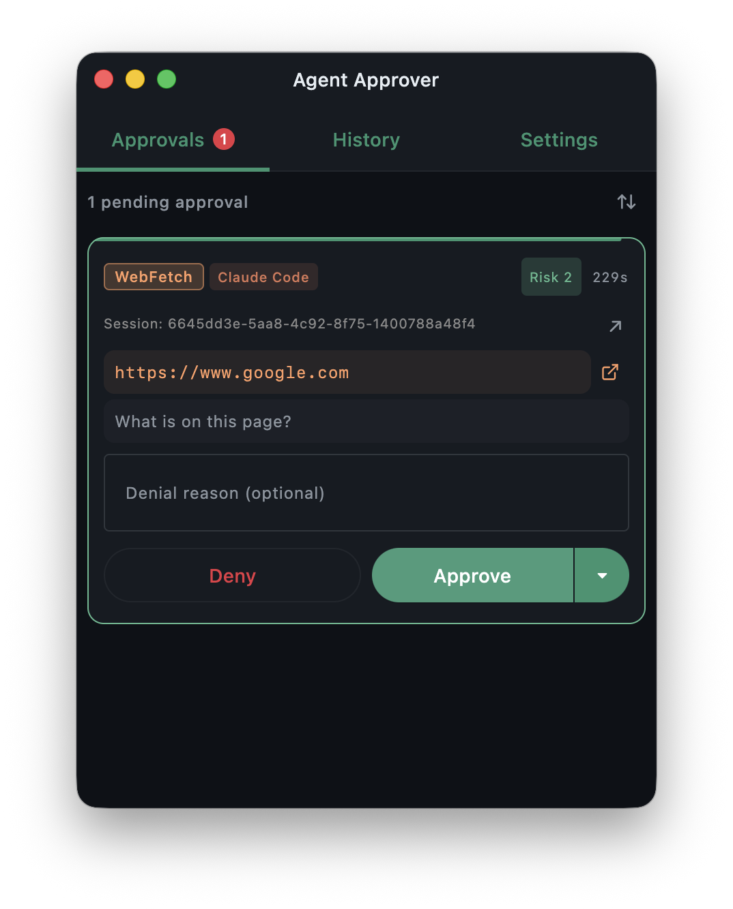
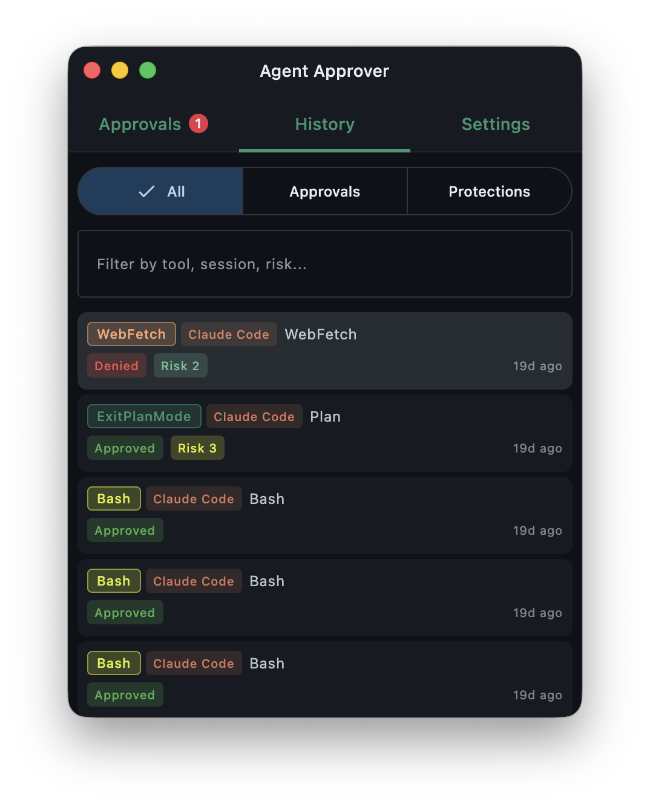
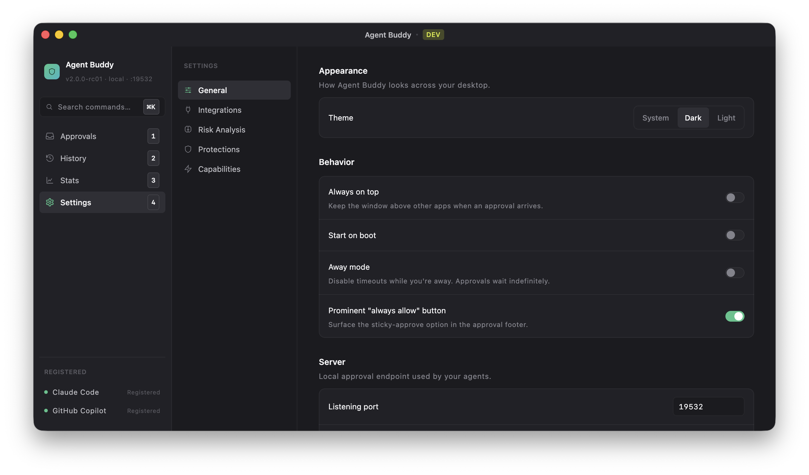
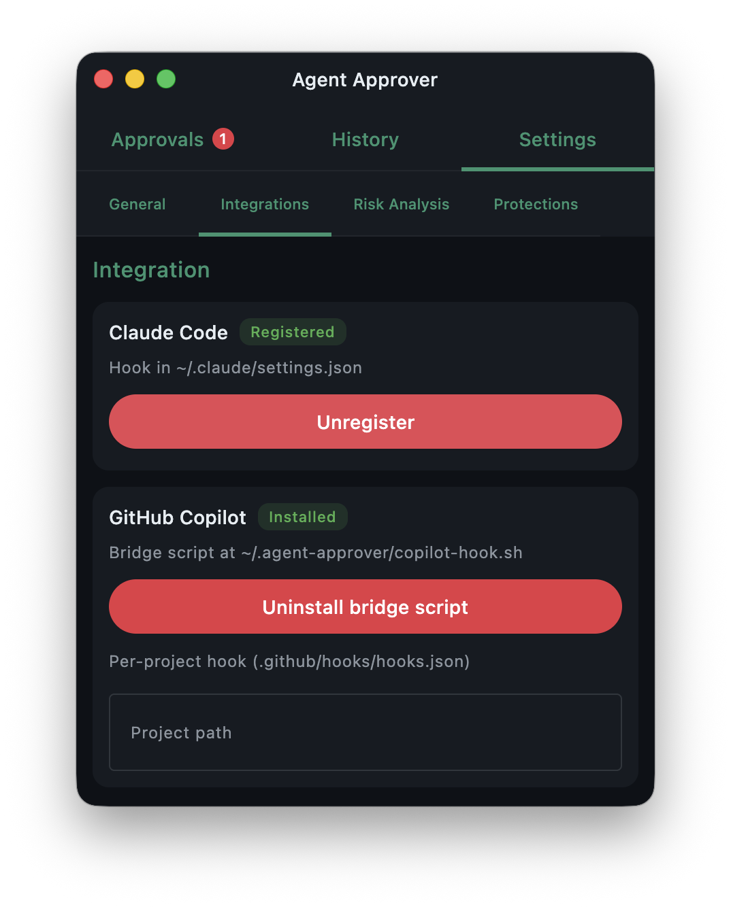
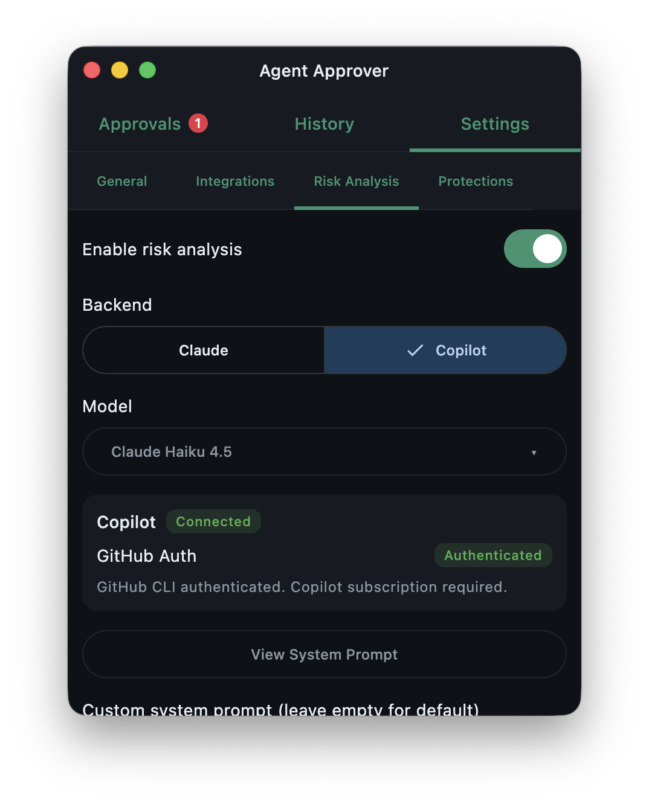
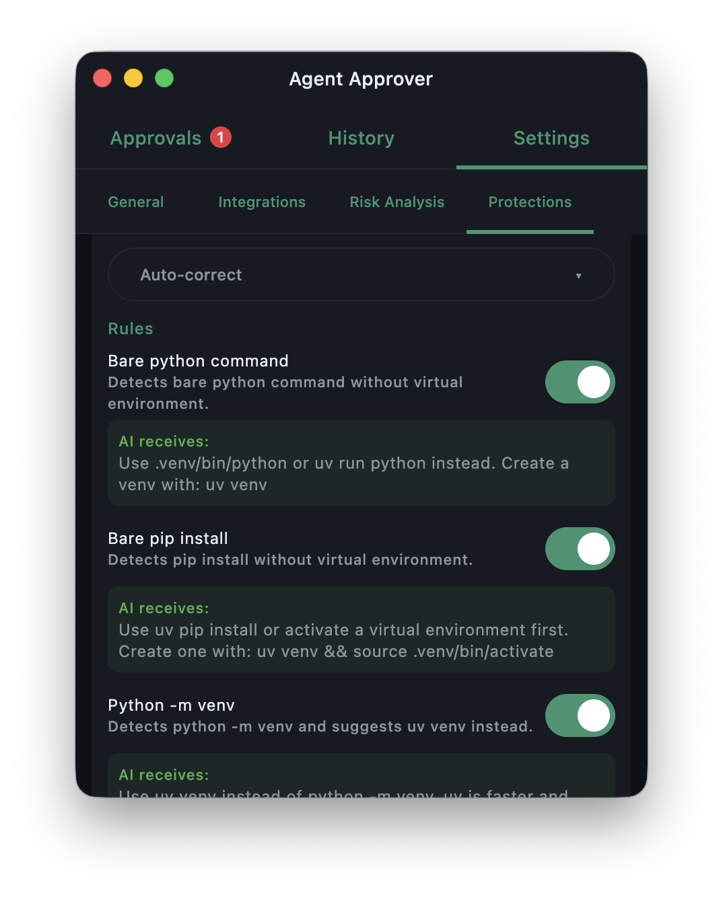

<p align="center">
  
</p>

<h1 align="center">Agent Approver</h1>

<p align="center">
  A desktop application that gives you full control over what AI coding agents can do on your machine.
</p>

<p align="center">
  <a href="https://github.com/mikepenz/agent-approver/actions/workflows/ci.yml"></a>
  <a href="https://github.com/mikepenz/agent-approver/blob/main/LICENSE"></a>
</p>

---

Agent Approver is a **human-in-the-loop gateway** for AI coding agents like [Claude Code](https://docs.anthropic.com/en/docs/claude-code) and [GitHub Copilot](https://github.com/features/copilot). It intercepts tool requests (file edits, shell commands, web fetches, etc.) via hook events, displays them in a review UI, and lets you approve or deny each action before it executes.

<p align="center">
  
  &nbsp;&nbsp;
  
  &nbsp;&nbsp;
  
</p>

### Key Features

- **Approval UI** — Review pending tool requests with syntax-highlighted diffs, command previews, and context
- **Protection Engine** — Built-in rules that block dangerous operations (destructive commands, credential access, supply-chain attacks)
- **Risk Analysis** — Optional AI-powered risk scoring (1-5) via Claude CLI or GitHub Copilot to auto-approve safe operations
- **Always Allow** — Grant persistent permissions for trusted tool patterns
- **Away Mode** — Disable timeouts for remote/async approval workflows
- **History** — Searchable log of all past approval decisions
- **System Tray** — Runs in the background with badge notifications for pending approvals
- **Cross-Platform** — macOS, Windows, and Linux with native packaging (DMG, MSI, DEB)

## Quick Start

### 1. Install

Download the latest release from [Releases](https://github.com/mikepenz/agent-approver/releases), or build from source:

```bash
git clone https://github.com/mikepenz/agent-approver.git
cd agent-approver
./gradlew :composeApp:run    # requires JDK 17+
```

### 2. Connect Your Agent

**Claude Code** — In Settings > Integrations, click **Register Hooks** to add entries to `~/.claude/settings.json`. This registers a `PermissionRequest` hook (interactive approvals) and a `PreToolUse` hook (protection engine checks).

**GitHub Copilot** — In Settings > Integrations, use the **Copilot Bridge** installer to set up the hook script and configure your project's `.github/hooks/hooks.json`. Copilot supports `PreToolUse` (protection checks) only.

### 3. Review & Approve

1. The AI agent sends a tool request to Agent Approver's local HTTP server
2. The **Protection Engine** evaluates the request against built-in safety rules
3. If the request passes, it appears in the **Approvals** tab for your review
4. You approve or deny — the response is sent back to the agent

## Protection Engine

Built-in modules detect and block dangerous patterns:

| Module | Examples |
|--------|----------|
| Destructive Commands | `rm -rf`, `git reset --hard`, force push |
| Credential & Supply-Chain Protection | `.env` files, SSH keys, `curl \| bash`, base64 decode + exec |
| Tool Bypass Prevention | `sed -i`, `perl -pi`, echo redirects bypassing Edit tool |
| Environment Safety | Bare `pip install`, absolute paths, uncommitted file edits |

Each module can be configured to: **Auto Block**, **Ask** (prompt user), **Auto-correct**, **Log Only**, or **Disabled**.

<p align="center">
  
  &nbsp;&nbsp;
  
  &nbsp;&nbsp;
  
</p>
<p align="center">
  
</p>

## Tech Stack

[Kotlin 2.3](https://kotlinlang.org/) (Multiplatform/JVM) | [Compose Multiplatform](https://www.jetbrains.com/compose-multiplatform/) | [Ktor](https://ktor.io/) | [SQLite](https://www.sqlite.org/) | [Nucleus](https://github.com/niclas-4712/nucleus)

## Contributing

See [CONTRIBUTING.md](CONTRIBUTING.md) for development setup and guidelines.

## License

Licensed under Apache 2.0. See [LICENSE](LICENSE) for details.
